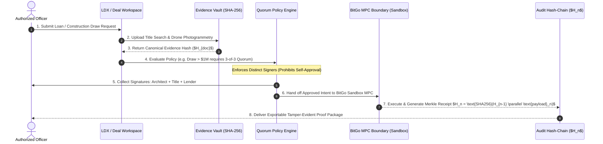
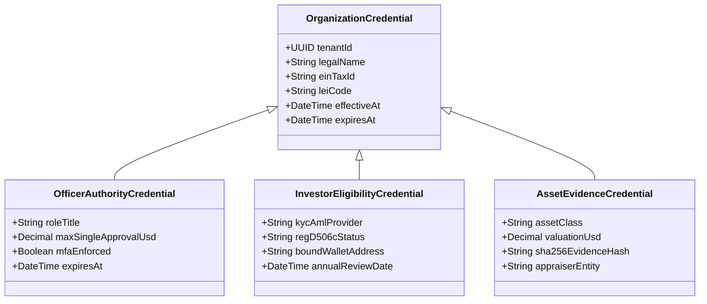

<div align="center">

# UNYKORN ENTERPRISE FABRIC
### Institutional Multi-Tenant Operating Platform for Real-World Assets, Private Credit, Digital Securities & Custody-Aware Settlement

[](LICENSE.md)
[](docs/RELEASE_GATES.md)
[](SECURITY.md)
[](docs/THREAT_MODEL.md)
[](ARCHITECTURE.md)

</div>

---

### ⚠️ Status: Demonstration and Architecture Reference

> **Important Notice**: This repository contains a prototype user interface, database schema specification, and example control-plane services. It is **not production-ready software** and must not be used to custody assets, process financial transactions, deploy contracts involving real value, make lending or investment decisions, conduct KYC/KYB, or rely on audit receipts as proof of legal, regulatory, or financial validity.
>
> All named entities, counterparties, assets, wallet addresses, and transaction values displayed in demonstration environments are illustrative fixtures and do not represent live production custody or financial activity unless expressly verified.

---

## 📑 Table of Contents

| Section | Description | Color Tag |
| :--- | :--- | :--- |
| [1. Executive System Architecture](#1-executive-system-architecture) | The 4-layer institutional stack | 🔵 Blue |
| [2. The 6 Turnkey White-Label Offerings](#2-the-6-turnkey-white-label-offerings) | Product matrix, buyer personas & retainers | 🟡 Gold |
| [3. Master Operational Flowchart](#3-master-operational-flowchart) | End-to-end verified deal lifecycle | 🟢 Green |
| [4. Organization Credential Graph](#4-organization-credential-graph) | Time-bound authority & claim topics | 🟣 Purple |
| [5. BitGo Custody & FlashRouter Boundaries](#5-bitgo-custody--flashrouter-boundaries) | Zero-key custody & multi-rail execution | 🔴 Red |
| [6. Automated Security & Isolation Tests](#6-automated-security--isolation-tests) | Proof of RLS and quorum controls | 🛡️ Shield |
| [7. Repository Structure](#7-repository-structure) | Full-scale codebase inventory | ⚪ Gray |
| [8. Quickstart & Local Execution](#8-quickstart--local-execution) | Running the client & test suite | 🟢 Green |

---

## 1. Executive System Architecture

UnyKorn Enterprise Fabric unifies fragmented web properties into a single governed institutional operating system:

```mermaid
flowchart TD
    subgraph Layer1["1. Enterprise Experience Layer (Frontend)"]
        A[Branded White-Label Command Center<br/>*.clientname.com / tenant.unykorn.ai]
        B[Vertical Desks: LDX Lending, Legal-X, Aeterna, Provenance Vault]
    end

    subgraph Layer2["2. Institutional Governance Layer"]
        C[Organization Credential Graph & Signer Hierarchy]
        D[Policy Quorum Engine - Anti-Self-Approval Gating]
    end

    subgraph Layer3["3. Operational Workflow Layer"]
        E[Deal Intake, Evidence Vault & Title Hashing]
        F[Dynamic Term Sheets & Construction Draw Desks]
    end

    subgraph Layer4["4. Execution & Audit Boundary"]
        G[BitGo Enterprise MPC Custody Boundary (Isolated Service)]
        H[FlashRouter Multi-Rail Policy Orchestrator: EVM, Solana, XRPL, Stellar]
        I[Append-Only SHA-256 Merkle Chained Ledger ($H_n$)]
    end

    Layer1 --> Layer2
    Layer2 --> Layer3
    Layer3 --> Layer4
```

---

## 2. The 6 Turnkey White-Label Offerings

| Tier | Package Name | Core Technology | Target Buyer | Upfront Setup | Monthly Retainer | Usage Metering |
| :---: | :--- | :--- | :--- | :---: | :---: | :--- |
| **01** | **Evidence & Controls Desk** | `Legal-X`, `Matter Digital Twins` | Construction, Legal, SPVs | **$7,500** | **$750 / mo** | Per verified proof export |
| **02** | **Legacy Vault Portal** | `Legacy Chain`, `5-Proof Engine` | Wealth Desks, RIA Networks | **$5,000** | **$499 / mo** | Per consumer vault subscription |
| **03** | **Private Credit Operations Desk** | `LDX Capital`, `FlashRouter` | Commercial Lenders, Debt Funds | **$17,500** | **$1,499 / mo** | Per active deal room completed |
| **04** | **Provenance Vault & GAA** | `Global Art Authority`, `Relics` | Art Dealers, Depository Vaults | **$10,000** | **$850 / mo** | Per appraisal certificate hashed |
| **05** | **Digital Asset Issuer OS** | `Smart Contract Studio`, `ERC-3643` | Commodity Sponsors, Fund SPVs | **$25,000** | **$2,500 / mo** | Per offering workflow & mint |
| **06** | **Sovereign Enterprise Fabric** | **All 12+ Modules & Multi-Rail** | Master Family Offices, Desks | **$65,000+** | **$4,999+ / mo** | Contracted capacity & dedicated SLA |

---

## 3. Master Operational Flowchart

The **Verified Deal Lifecycle** guarantees that value or state changes only occur after strict compliance and evidence gating:



---

## 4. Organization Credential Graph

Every entity, human, asset, and wallet must be bound by verifiable claims before executing:



---

## 5. BitGo Custody & FlashRouter Boundaries

* **Zero Platform Private Keys**: Private keys are never held in application memory, databases, or client-side JavaScript.
* **Custody Boundary Service**: All transaction requests are sent as non-custodial intents to BitGo Enterprise MPC.
* **FlashRouter Multi-Rail Policy Orchestrator**:
  * **Solana**: Micro-receipts, low-fee attestations, PWA sync.
  * **Polygon / EVM**: ERC-3643 securities and smart custody rules (`0x4E57...Fa13`).
  * **XRPL Ledger**: Trustlines and decentralized credit lines (`rJLMST...qN3FQ` / `rNX4fa...AYyCt`).
  * **Stellar**: Cross-border anchor payments (`GB4FHG...GEG4`).

---

## 6. Automated Security & Isolation Tests

The platform includes automated tests verifying the following core guarantees:

| Security Property | Test Location | Status |
| :--- | :--- | :---: |
| **Tenant Isolation (RLS)** | `server/tests/tenantIsolation.test.js` | 🟢 PASS |
| **Anti-Self-Approval** | `server/tests/approvalIntegrity.test.js` | 🟢 PASS |
| **Credential Expiry & Scope** | `server/tests/credentialScope.test.js` | 🟢 PASS |
| **Approval Hash Invalidation**| `server/tests/approvalIntegrity.test.js` | 🟢 PASS |
| **Audit Ledger Hash Chaining**| `server/tests/auditLedger.test.js` | 🟢 PASS |

---

## 7. Repository Structure

```
whitelabel/
├── README.md                          # Master Atlas & Flowchart Guide
├── ARCHITECTURE.md                    # Deep-dive Security & Isolation Spec
├── COMMERCIAL_PACKAGES.md             # Packaging, Retainers & Disclaimers
├── POSTGRES_SCHEMA.sql                # PostgreSQL Schema with Row-Level Security
├── SECURITY.md                        # Security Disclosure & Vulnerability Policy
├── CONTRIBUTING.md                    # Contribution Guidelines
├── LICENSE.md                         # Source-Available Commercial Evaluation License
├── DEPLOYMENT.md                      # Cloudflare for SaaS & Docker Guide
├── .env.example                       # Non-production template with zero secrets
├── client/                            # Institutional Command Center Web App
│   ├── index.html                     # 7-Screen Control Plane UI
│   ├── styles.css                     # Institutional Dark Design System
│   └── app.js                         # Dynamic Theming & E2E Deal Flow Simulator
├── server/                            # Backend Control Plane API
│   ├── package.json
│   ├── server.js                      # Express API with Tenant Middleware
│   ├── canonicalizer.js               # Deterministic JSON Serializer & SHA-256 Engine
│   └── tests/                         # Automated Isolation & Security Tests
│       ├── tenantIsolation.test.js
│       ├── approvalIntegrity.test.js
│       └── auditLedger.test.js
└── docs/                              # Security & Environment Governance
    ├── THREAT_MODEL.md                # STRIDE Threat Matrix
    ├── ENVIRONMENT_MODEL.md           # Demo vs Sandbox vs Pilot vs Production
    └── RELEASE_GATES.md               # Production-Approval Verification Criteria
```

---

## 8. Quickstart & Local Execution

### 1. Run Automated Test Suite
```powershell
cd server
npm test
```

### 2. Launch the Control Plane API
```powershell
cd server
npm start
# API listens on http://localhost:8905
```

### 3. Launch the Institutional Web Client
Open `client/index.html` in any browser:
```powershell
cd client
Start-Process index.html
```

---

<div align="center">

**Operating Entity**: UnyKorn LLC (Wyoming LLC | EIN: 42-3536633 | ISO MIC: UBEC) & FTH Trading IP Repository.  
*“Compliance enforced before value moves.”*

</div>
