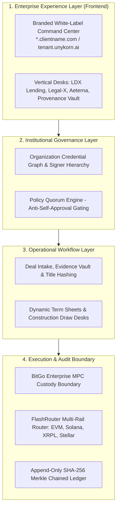
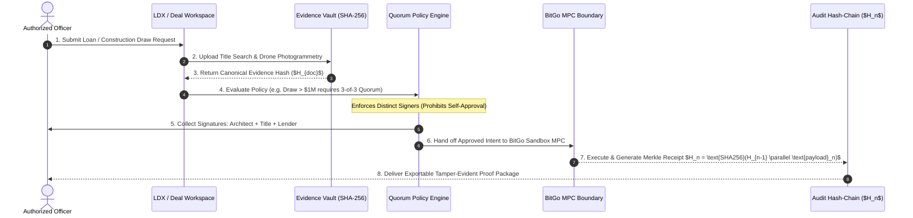
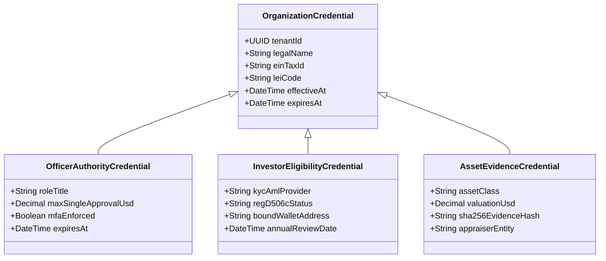

<div align="center">

# UNYKORN ENTERPRISE FABRIC
### Institutional Multi-Tenant Operating Platform for Real-World Assets, Private Credit, Digital Securities & Custody-Aware Settlement

[](LICENSE.md)
[](DEPLOYMENT.md)
[](ARCHITECTURE.md)
[](ARCHITECTURE.md)
[](ARCHITECTURE.md)

</div>

---

> **Environment Disclosure**: This repository contains the **UnyKorn Enterprise Fabric** command center, database schema specifications, and backend API control plane. All named entities, counterparties, assets, wallet addresses, and transaction amounts displayed in demonstration environments are illustrative fixtures and do not represent live production custody or financial activity unless expressly verified.

---

## 📑 Table of Contents

| Section | Description | Color Tag |
| :--- | :--- | :--- |
| [1. Executive System Architecture](#1-executive-system-architecture) | The 4-layer institutional stack | 🔵 Blue |
| [2. The 6 Turnkey White-Label Offerings](#2-the-6-turnkey-white-label-offerings) | Product matrix, buyer personas & retainers | 🟡 Gold |
| [3. Master Operational Flowchart](#3-master-operational-flowchart) | End-to-end verified deal lifecycle | 🟢 Green |
| [4. Organization Credential Graph](#4-organization-credential-graph) | Time-bound authority & claim topics | 🟣 Purple |
| [5. BitGo Custody & FlashRouter Boundaries](#5-bitgo-custody--flashrouter-boundaries) | Zero-key custody & multi-rail execution | 🔴 Red |
| [6. Repository Structure](#6-repository-structure) | Full-scale codebase inventory | ⚪ Gray |
| [7. Quickstart & Deployment](#7-quickstart--deployment) | Running the client & server locally | 🟢 Green |

---

## 1. Executive System Architecture

UnyKorn Enterprise Fabric unifies fragmented web properties into a single governed institutional operating system:



---

## 2. The 6 Turnkey White-Label Offerings

| Tier | Package Name | Core Technology | Target Buyer | Upfront Setup | Monthly Retainer | Usage Metering |
| :---: | :--- | :--- | :--- | :---: | :---: | :--- |
| **01** | **Evidence & Controls Desk** | `Legal-X`, `Matter Digital Twins` | Construction, Legal, SPVs | **$7,500** | **$750 / mo** | Per verified proof export |
| **02** | **Legacy Vault Portal** | `Legacy Chain`, `5-Proof Engine` | Wealth Desks, RIA Networks | **$5,000** | **$499 / mo** | Per consumer vault subscription |
| **03** | **Private Credit Operations Desk** | `LDX Capital`, `FlashRouter` | Commercial Lenders, Debt Funds | **$17,500** | **$1,499 / mo** | Per active deal room completed |
| **04** | **Provenance Vault & GAA** | `Global Art Authority`, `Relics` | Art Dealers, Depository Vaults | **$10,000** | **$850 / mo** | Per appraisal certificate hashed |
| **05** | **Digital Asset Issuer OS** | `Smart Contract Studio`, `ERC-3643` | Commodity Sponsors, Fund SPVs | **$25,000** | **$2,500 / mo** | Per offering workflow & mint |
| **06** | **Sovereign Enterprise Fabric** | **All 12+ Modules & Multi-Rail** | Master Family Offices, Desks | **$65,000+** | **$4,999+ / mo** | Contracted capacity & dedicated SLA |

---

## 3. Master Operational Flowchart

The **Verified Deal Lifecycle** guarantees that value or state changes only occur after strict compliance and evidence gating:



---

## 4. Organization Credential Graph

Every entity, human, asset, and wallet must be bound by verifiable claims before executing:



---

## 5. BitGo Custody & FlashRouter Boundaries

* **Zero Platform Private Keys**: Private keys are never held in application memory, databases, or client-side JavaScript.
* **Custody Boundary Service**: All transaction requests are sent as non-custodial intents to BitGo Enterprise MPC.
* **FlashRouter Multi-Rail Settlement Engine**:
  * **Solana**: Micro-receipts, low-fee attestations, PWA sync.
  * **Polygon / EVM**: ERC-3643 securities and smart custody rules (`0x4E57...Fa13`).
  * **XRPL Ledger**: Trustlines and decentralized credit lines (`rJLMST...qN3FQ` / `rNX4fa...AYyCt`).
  * **Stellar**: Cross-border anchor payments (`GB4FHG...GEG4`).

---

## 6. Repository Structure

```
whitelabel/
├── README.md                          # Master Atlas & Flowchart Guide
├── ARCHITECTURE.md                    # Deep-dive Security & Isolation Spec
├── COMMERCIAL_PACKAGES.md             # Packaging, Retainers & Disclaimers
├── POSTGRES_SCHEMA.sql                # PostgreSQL Schema with Row-Level Security
├── LICENSE.md                         # License Agreement
├── DEPLOYMENT.md                      # Cloudflare for SaaS & Docker Guide
├── client/                            # Institutional Command Center Web App
│   ├── index.html                     # 7-Screen Control Plane UI
│   ├── styles.css                     # Institutional Dark Design System
│   └── app.js                         # Dynamic Theming & E2E Deal Flow Simulator
├── server/                            # Backend Control Plane API
│   ├── package.json
│   ├── server.js                      # Express API with Tenant Middleware
│   └── canonicalizer.js               # Deterministic JSON Serializer & SHA-256 Engine
└── docs/                              # Architecture Diagrams & Flowcharts
    ├── system_layers_flowchart.mmd
    ├── verified_deal_lifecycle.mmd
    └── credential_graph_model.mmd
```

---

## 7. Quickstart & Local Execution

### 1. Launch the Backend API Server
```powershell
cd server
npm install
npm start
# Server listens on http://localhost:8905
```

### 2. Launch the Institutional Web Client
Open `client/index.html` directly in your browser or serve via any static web server:
```powershell
cd client
# Open in default browser:
Start-Process index.html
```

---

<div align="center">

**Operating Entity**: UnyKorn LLC (Wyoming LLC | EIN: 42-3536633 | ISO MIC: UBEC) & FTH Trading IP Repository.  
*“Compliance enforced before value moves.”*

</div>
